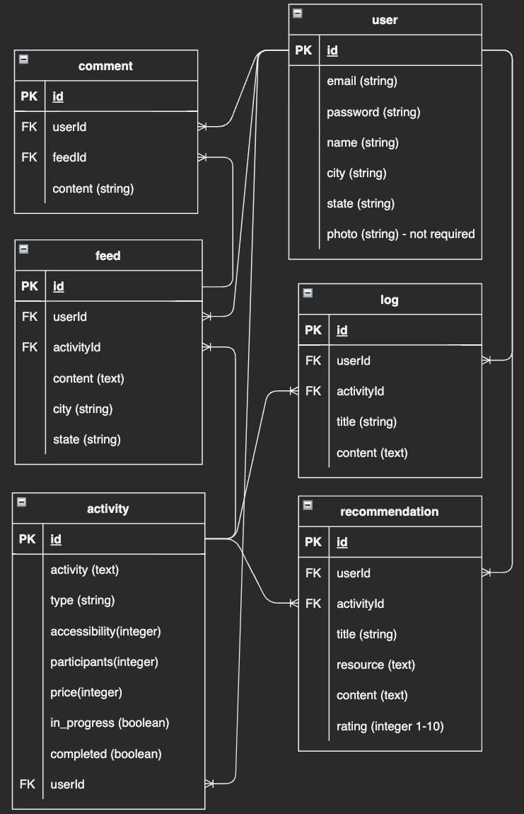
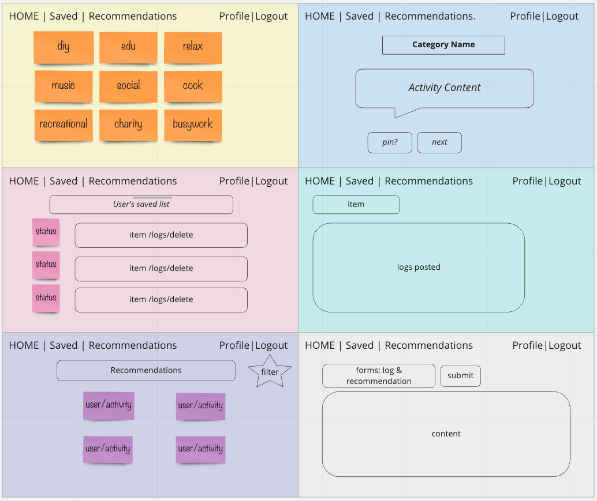

# ThisWeekend
## Description
One of the hardest questions for me to answer has always been...what is your hobby?
This app is for people like me who wants to have productive and eventful weekends full of activities, but always wind up binging on netflix because I simply don't know what exactly to do.
I'll be integrating the Bored API (http://www.boredapi.com/api/activity/) to bring in random activities by category: ["education", "recreational", "social", "diy", "charity", "cooking", "relaxation", "music", "busywork"] and enable users to swipe through activities for inspiration and add items to their own todo list. 
* This API does not require a key, and I've tested its functionality.

## ERDs

## RESTful Routing Chart
| HTTP METHOD  | URL | CRUD | Response           | Notes |
| -------------------- | ------------- | ---- | --------           | ----- |
| GET                  | /       | READ | List of search categories |Homepage with intro to site. Links to each Category in body. Nav Links to Saved & Feed      |
| GET                  | /saved     | READ | List of all saved activities | Allow user to see their saved activities by category and links to write logs/ create recommendation |
| GET                  | /:category | READ | Display activity for selected category | User can swipe through activity to pass or save each activity
| GET                  | /recommendations | READ | all recommendations posted | User can view all recommendations posted public by all users
| GET | /profile | READ | user data | display user profile
| POST | /saved | CREATE | saved activity | save activity user chose (redirect to /saved)
POST | /saved/logs | CREATE | Add logs to each activity "in progress" | User can add and post Logs to activities they've marked as "in progress"
PUT | /saved/logs | UPDATE | Update logs posted | user can update logs posted on each activity
GET | /saved/completed | READ | activity completed | user can view list of completed activities and have the option to select to write recommendations
DELETE | /saved | DESTROY | delete saved | user can delete saved activity no longer wanted
GET | /saved/recommendations | READ | user's recommendations | display recommendations by specific user
POST | /recommendations/:activityId  | CREATE | post new recommendation | user can post new recommendation on completed activities
PUT| recommendations/:activityId  | UPDATE | edit recommendation post | user can make edits to recommendation posted
DELETE | recommendations/:activityId  | DESTROY | delete recommendation | user can delete posted recommendations

## Wireframes

## User Stories
* As a user, I want to choose which category I wish to explore for inspiration, and have the ability to swipe through activities and save ones I am interested in
* As a user, I want to be able to log/journal experiences for activities I started to do, or completed
* As a user, I want to be able to post recommendations for select activities to let other users know of my experience, and why I recommend.
* As a user, I want to see what other users have done and recommend, and any resources they have provided
* As a user, I want to be able to connect with other users in my area 

## MVP goals
* Render activities pulled from Bored API by category, and give user the option to pass or save on each activity displayed
* Add Delete function to each saved activity for user to destroy any items no longer wanted
* Create forms for users to post personal logs/reflections on each activity in progress/completed
* Display logs posted for each activity in progress or completed
* Enable Edit/Update for logs posted

## Stretch goals
* Create forms for posting recommendations (for public feed) once user marks an activity as completed
* Render 'recommendations' feed page where all users' recommendation posts are displayed. Add filter by category
* Add swipe functionality to activities page by category
* Add comments section for each recommendation posted - create comment model 1:M to recommendations
* Add social page where users can reach out to other users in the close by location for activities requiring multiple people (by using 'Participants' from API)
* Use another API (geoapify) for user to find eateries/things to do in selected location/area as bonus aspect in finding "what to do"

